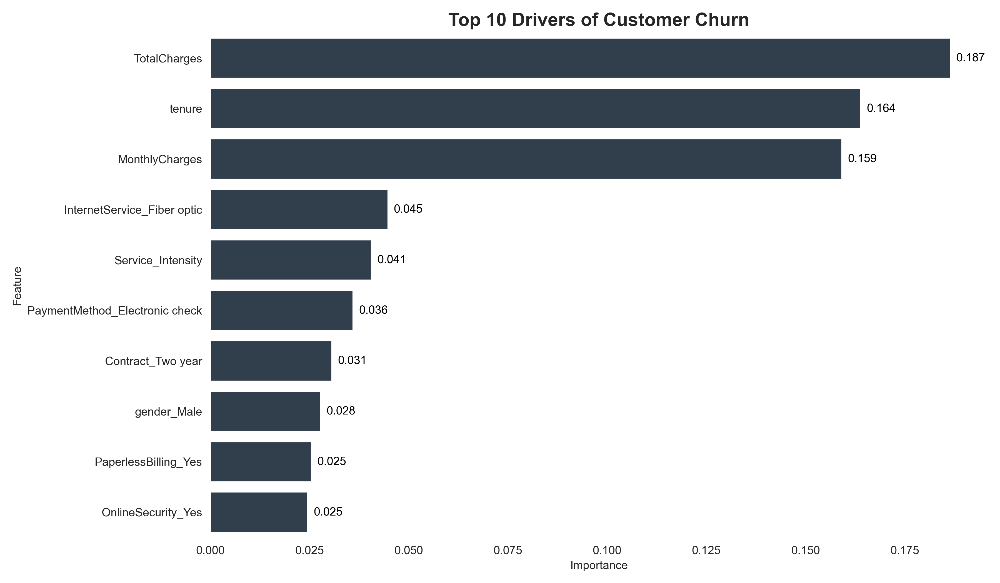

# Telco Customer Churn & Revenue Risk Analysis

### Executive Summary
This project addresses customer churn by moving beyond simple prediction to financial quantification. By analyzing customer demographics, services, and tenure data, I built a machine learning model to identify high-risk customers. Crucially, I integrated these predictions with monthly billing data to calculate the "Revenue at Risk," allowing stakeholders to prioritize retention efforts on high-value accounts rather than broad, un-targeted campaigns. The analysis successfully identified over $94,000 in immediate revenue risk within the test segment alone.

### Technical Methodology
The analysis began with data preprocessing and the engineering of a custom "Service Intensity" feature to hypothesis-test whether customers with deeper service bundles are less likely to churn. I utilized a Random Forest Classifier for the modeling phase due to its interpretability and ability to handle non-linear relationships between categorical variables like payment methods and contract types. Finally, I mapped the model's probability outputs against monthly charges to generate a ranked list of customers representing the highest financial loss to the company.

### Key Findings
* **Financial Impact:** The model isolated a high-risk segment representing $94,264 in potential annual revenue loss.
* **Pricing Sensitivity:** Customers with higher total lifetime spend showed increased churn probability, indicating possible dissatisfaction with value among top-tier users.
* **Contract Influence:** Customers on month-to-month contracts were the single largest source of churn, whereas two-year contract holders remained highly stable.
* **Service Issues:** Users with Fiber Optic internet churned at significantly higher rates than DSL users, pointing to potential technical or reliability issues with that specific infrastructure.

### Key Visuals
**1. Top Drivers of Churn**
The model identifies specific features (like Pricing and Fiber Optic service) as the primary indicators of risk.

**2. Contract Analysis**
Month-to-month contracts are the single biggest risk factor, whereas 2-year contracts effectively eliminate churn.

### Project Structure
* **churn_analysis.ipynb:** The primary notebook containing data cleaning, exploratory analysis, model training, and revenue calculations.
* **WA_Fn-UseC_-Telco-Customer-Churn.csv:** The raw dataset used for analysis.

### Installation and Usage
To replicate this analysis, clone the repository and install the required dependencies listed in requirements.txt. Run the Jupyter Notebook to view the data visualizations and generate the revenue risk assessment.
